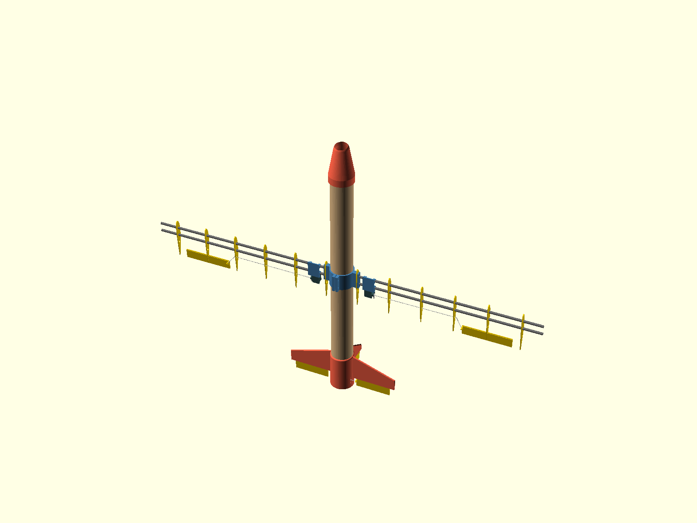

# Starling



**Starling** is an open-source, cheap, quick-to-assemble RC plane built around a paper tube. The fuselage is a ~53 mm postal tube; everything structural that isn't the tube is 3D printed or off the shelf. It is deliberately **not** built to last — it's built to be so cheap and fast to assemble that it can be treated as single-use for whatever job it's needed for (painting the tube adds some weather resistance if you want more than one flight).

## Project goals

1. **Cheap and expendable** — paper-tube fuselage, printed joints, hobby-grade electronics. Losing the airframe should not hurt.
2. **Payload modularity** — payloads ride *inside* the tube, not bolted to the outside. The tube is one uncut length, cut to suit the mission; a printed adapter wraps the payload so it slides into the tube bore (~47 mm) and can be positioned anywhere along it. A payload that is already a cylinder of the right diameter needs no adapter at all.
3. **Movable wing** — the wing mount slides along the tube to re-trim CG for whatever payload is fitted.
4. **Quick assembly** — parts slide over/into the tube; the goal is field-assembly speed, not workshop craftsmanship.
5. **ArduPilot brain** — flight controller config will live in this repo alongside the CAD (planned).

## Airframe

| Part | File | Notes |
|---|---|---|
| Fuselage | (bought, not printed) | 50 mm-class paper/postal tube, ~53 mm OD |
| Nose cone | `cad/nose.scad` | Sleeve-mounted, angled FPV camera opening |
| Wing adapter (trim rig) | `cad/wing_adapter.scad` | Reusable tooling: M3 belly clamp locks it anywhere along the tube while you find the CG for a payload |
| Wing adapter (flight) | `cad/wing_adapter_glue.scad` | Same wing interface, no hardware; slid to the documented station and tacked with hot-glue fillets at the rims (`docs/wing-stations.md`) |
| Wing ribs | `cad/wing_rib.scad`, `cad/wing_rib_servo.scad` | NACA airfoil ribs on 6 mm carbon spars, foam-board skin; all ribs sit outboard of the adapter tab, and the servo rib carries the aileron servo |
| Tail sleeve | `cad/tail.scad` | Prints upright, support-free: internal push-fit servo pockets, angled pushrod slots, fin sockets, rear motor mount (pusher) |
| Tail fins | `cad/tail_fin_horizontal.scad` (×2), `cad/tail_fin_vertical.scad` | Print flat (strongest orientation); root tabs glue into the sleeve's fin sockets |
| Control surfaces | `cad/control_surface.scad` | One part, three spans (elevator/rudder/aileron); tape-strip hinge in matching grooves |
| Calibration prints | `cad/calibration/` | Tube fit ring (OD), tube bore gauge (ID), motor screw pattern, servo pocket — print these first |

All servos mount internally — the tail servos sit high in the sleeve with angled wire slots, the aileron servos hide inside the wing with just the arm through the upper skin. Mechanical throw: ±32° tail / ±45° aileron vs ±25°/±20° targets — analysis in `docs/control-system.md`, checked by `scripts/throw_check.py`.

Print-ready STLs for every part are committed under `stl/`.

## Calibrate to your tube first

Postal tube varies between batches, and the paper wall varies more than the outside does — so the OD does not tell you the bore. Both are measured, and both gauges print as **three numbered variants at once**:

| Print | Measures | Set |
|---|---|---|
| `stl/tube_fit_ring.stl` | outside diameter — what sleeves slide over | `tube_od` |
| `stl/tube_bore_gauge.stl` | inside diameter — what plugs slide into | `tube_id` |

Print one, try all three variants on your actual tube, and read the number engraved on the one that fits best. Type those two numbers into `cad/design_params.scad`, re-run `scripts/regen_all.py`, and every sleeve and plug in `stl/` is now cut for your tube. If the winner is an end variant your tube is outside the bracket — set the value to that number and reprint the gauge to re-centre.

## Working on the CAD

Tooling is Python + OpenSCAD, fully headless, fetched via nix (no manual installs):

```bash
python3 scripts/regen_all.py            # gates + rebuild every STL + assembly render
python3 scripts/regen_all.py --stl-only # export everything printable to stl/
python3 scripts/check_params.py         # do the parts still fit the same tube?
python3 scripts/throw_check.py          # control-surface throw / slot / clearance check
python3 scripts/render_scad.py cad/nose.scad nose.png   # one-off render
```

`scripts/regen_all.py` is the single entry point for derived artifacts — the STLs and `main_assembly.png` are build products and regenerate with the CAD that changed them. Every dimension two parts share (tube OD, clearances, spar chain, servo/motor footprints, stations) lives in **`cad/design_params.scad`**; parts include it, and `check_params.py` fails the build if any file shadows a shared name — so the parts can never silently disagree about the tube they share.

## Status

Early prototype. Structural parts exist, print, and fit together on paper (see `docs/design-review.md` for the reviewed-and-fixed findings and the open follow-ups: measure your actual tube, pick the motor/prop combo). Wing skin build notes and the ArduPilot configuration are next.
